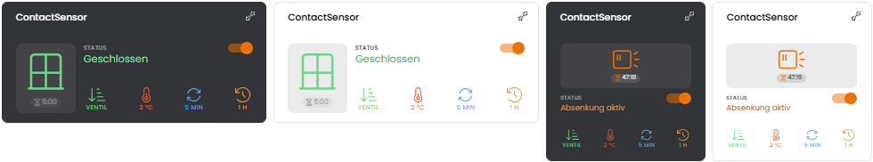
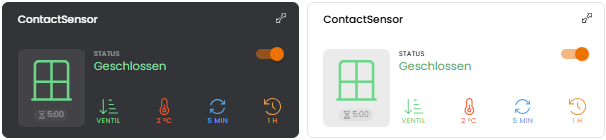
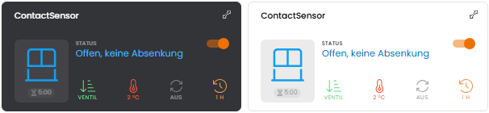
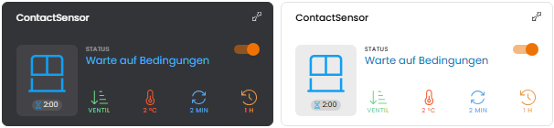
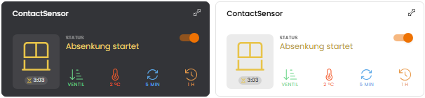
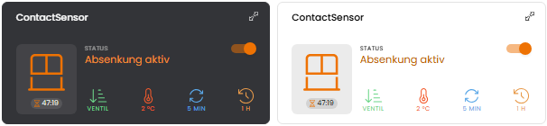
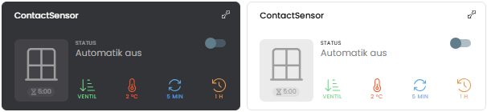

# 🪟 Fenster- und Türkontakt (Contact Sensor)

Das Modul reagiert entsprechend hinterlegter Verzögerungszeit und Bedingungen auf das Öffnen bzw. Schließen von Fenster- bzw. Türkontakten und führt eine Temperaturabsenkung durch.  
  
Wer die Meldungsverwaltung (Thema: [Meldungsanzeige im WebFront](https://www.symcon.de/forum/threads/12115-Meldungsanzeige-im-WebFront?highlight=Meldungsverwaltung)) nutzt, kann sich über den Schaltvorgang informieren lassen.

## Inhaltverzeichnis

1. [Funktionsumfang](#user-content-1-funktionsumfang)
2. [Voraussetzungen](#user-content-2-voraussetzungen)
3. [Installation](#user-content-3-installation)
4. [Einrichtung](#user-content-4-einrichtung)
5. [Statusvariablen](#user-content-5-statusvariablen)
6. [Darstellungen](#user-content-6-darstellungen)
7. [Visualisierung](#user-content-7-visualisierung)
8. [Befehlsreferenz](#user-content-8-befehlsreferenz)
9. [Versionshistorie](#user-content-9-versionshistorie)

### 1. Funktionsumfang

* Überwachen beliebig vieler Kontaktsensoren (z.B. pro Raum), jeder Wert ungleich 0 gilt als offen (auch gekippt)
* Verzögertes Absenken der Heizung entsprechend eingestellter Zeit
* Schalten beliebig vieler Heizkörper (Thermostate bzw. Stellantriebe) herstellerneutral per `RequestAction`
* Bedingtes Schalten in Abhängigkeit ...
  * der Ventilstellung / Ventilöffnung
  * der Differenz zwischen Außen- und Innentemperatur
  * Wiederholtes Testen der Bedingungen nach einstellbarer Zeit
* Automatisches Aufheben der Absenkung unabhängig vom Zustand der Sensoren
* Statusvariablen zum Steuern des bedingten Schaltens (z.B. über die Kachel-Visualisierung)
* Testfunktionen im Aktionsbereich der Konfiguration

### 2. Voraussetzungen

* Symcon ab Version 8.1
* Heizkörper mit schaltbarer Fensterstatus-Variable (Bool, Integer oder Float mit Aktion), z.B. `WINDOW_STATE` bei HmIP-WTH2 und HmIP-eTRV(-2)

### 3. Installation

* Über den Modul Store das Modul _Fenster- und Türkontakt_ installieren.
* Alternativ über das Modul Control folgende URL hinzufügen.  
`https://github.com/Wilkware/ContactSensor` oder `git://github.com/Wilkware/ContactSensor.git`

### 4. Einrichtung

* Unter 'Instanz hinzufügen' ist das _Fenster- und Türkontakt_-Modul (Alias: _Türkontakt_, _Fensterkontakt_) unter dem Hersteller '(Geräte)' aufgeführt.

__Konfigurationsseite__:

Einstellungsbereich:

> 🪟 Kontakt-Sensoren ...

Name                            | Beschreibung
------------------------------- | -----------------------------------------------------------------
Sensoren                        | Liste der Statusvariablen der Kontaktsensoren (0/false = geschlossen, jeder andere Wert = offen) mit Typ je Sensor (Fenster, Dachfenster, Tür, Terrassentür oder Sonstiges); der Typ bestimmt das Symbol in der Kachel

> 🔀 Bedingtes Schalten ...

Name                            | Beschreibung
------------------------------- | -----------------------------------------------------------------
Reaktionszeit (Verzögerung)     | Zeit zwischen Erkennen und Schalten
Positionsvariable               | Variable, welche die aktuelle Ventilposition enthält (für die Prüfung der Ventilstellung)

_Hinweis:_ Ob Ventilstellung und Temperaturdifferenz (auch wiederholt) geprüft werden und ob bzw. wann die Absenkung automatisch aufgehoben wird, wird über die Statusvariablen eingestellt (siehe 5.).

> 🔥 Heizungssystem ...

Name                            | Beschreibung
------------------------------- | -----------------------------------------------------------------
Fensterstatus-Variablen         | Liste der Fensterstatus-Variablen der Thermostate bzw. Stellantriebe (offen = true/1, geschlossen = false/0), Schalten per RequestAction

> 🌡️ Klimawerte ...

Name                            | Beschreibung
------------------------------- | -----------------------------------------------------------------
Innentemperatur                 | Aktuelle Raumtemperatur
Außentemperatur                 | Aktuelle Außentemperatur

> 🔔 Meldungsverwaltung ...

Name                                 | Beschreibung
------------------------------------ | -----------------------------------------------------------------
Meldung an Anzeige senden            | Auswahl ob Eintrag in die Meldungsverwaltung erfolgen soll oder nicht (Ja/Nein)
Auslöser der Nachricht               | Auswahl bei welcher Aktion eine Nachricht erfolgen soll
Lebensdauer der Nachricht (Öffnen)   | Wie lange soll die öffnende Meldung angezeigt werden?
Lebensdauer der Nachricht (Schließen)| Wie lange soll die schließende Meldung angezeigt werden?
Nachricht an Visualisierung senden   | Auswahl ob Push-Nachricht gesendet werden soll oder nicht (Ja/Nein)
Auslöser der Nachricht               | Auswahl bei welcher Aktion eine Nachricht erfolgen soll
Raumname                             | Text zur eindeutigen Zuordnung des Raums
Format der Textmitteilung (Öffnen)   | Frei wählbares Format der öffnenden Nachricht/Meldung
Format der Textmitteilung (Schließen)| Frei wählbares Format der schließenden Nachricht/Meldung
Visualisierungs-Instanz              | ID der Visualisierung, an welches die Push-Nachrichten gesendet werden soll (WebFront oder TileVisu Instanz)
Meldungsskript                       | Skript ID des Meldungsverwaltungsskripts

> ⚙️ Erweiterte Einstellungen ...

Name                            | Beschreibung
------------------------------- | -----------------------------------------------------------------
Gleichzeitiges Ausführen eines Skriptes | Auswahl eines Skriptes, welches nur oder zusätzlich ausgeführt werden soll (IPS_RunScriptEx). Status 1(open) bzw. 0(close) wird im Array als 'WINDOW_STATE' übergeben. Die ID des ausführenden Moduls wird in 'MODUL' mitgegeben.

Aktionsbereich:

Name                            | Beschreibung
------------------------------- | -----------------------------------------------------------------
Temperatur absenken             | Schaltet die Heizkörper (und das Skript) direkt auf OFFEN, ohne Prüfung der Bedingungen
Absenkung aufheben              | Hebt eine aktive Absenkung auf

_Hinweis:_ Bestehende Konfigurationen (4 Sensoren, 2 HomeMatic-Instanzen) werden automatisch in die neuen Listen übernommen.

### 5. Statusvariablen

Die Statusvariablen werden automatisch angelegt. Das Löschen einzelner kann zu Fehlfunktionen führen.

Name                           | Typ     | Beschreibung
------------------------------ | ------- | ------------------------------------------------------------
Automatik                      | Boolean | Schaltet die automatische Absenkung ein/aus
Ventilstellung prüfen          | Boolean | Absenkung nur bei laufender Heizung (Ventilstellung > 0%)
Temperaturdifferenz prüfen     | Boolean | Absenkung nur bei Überschreiten der Temperaturdifferenz
Temperaturdifferenz            | Integer | Schwellwert zwischen Innen- und Außentemperatur
Bedingungen wiederholt prüfen  | Integer | Intervall der erneuten Prüfung der Bedingungen
Absenkung automatisch aufheben | Integer | Zeitspanne bis zur automatischen Aufhebung der Absenkung
Absenkung                      | Boolean | Anzeige, ob die Absenkung aktiv ist (nur lesend)

_Hinweis:_ Die Statusvariablen sind die einzige Quelle für die Einstellungen des bedingten Schaltens. Beim Update von v3.x werden sie mit den bisherigen Konfigurationswerten initialisiert.

### 6. Darstellungen

Die Darstellungen werden direkt an den Statusvariablen hinterlegt, es werden keine Profile angelegt.

Variable                       | Darstellung   | Werte
------------------------------ | ------------- | ------------------------------------------------------------
Automatik                      | Schalter      | An / Aus
Ventilstellung prüfen          | Schalter      | An / Aus
Temperaturdifferenz prüfen     | Schalter      | An / Aus
Temperaturdifferenz            | Schieberegler | 0 – 30 °C (Schrittweite 1)
Bedingungen wiederholt prüfen  | Aufzählung    | Aus, 1, 2, 3, 4, 5, 10, 15 min
Absenkung automatisch aufheben | Aufzählung    | Aus, 10, 20, 30, 40, 50 min, 1, 2, 5 h
Absenkung                      | Wertanzeige   | Inaktiv (false), Aktiv (true)

### 7. Visualisierung

Das Modul bringt eine eigene Kachel für die Kachel-Visualisierung mit:

* Symbol je nach Typ der Sensoren (Fenster, Dachfenster, Tür, Terrassentür; bei gemischten Typen oder Sonstiges ein allgemeines Sensorsymbol) geöffnet bzw. geschlossen und Zustandstext in Zustandsfarbe (Geschlossen, Offen, Absenkung startet, Warte auf Bedingungen, Absenkung aktiv, Automatik aus)
* Countdown für Verzögerung, nächste Prüfung bzw. automatische Aufhebung
* Schalter für die Automatik (oben rechts)
* Leiste mit den Einstellungen des bedingten Schaltens (Ventil, Temperatur, Wiederholen, Aufheben); Ventil wird per Tippen umgeschaltet, die übrigen öffnen einen Slider

Geschlossen:

Offen, keine Absenkung (Bedingungen nicht erfüllt):

Warte auf Bedingungen (Countdown bis zur nächsten Prüfung):

Absenkung startet (Verzögerung läuft):

Absenkung aktiv (Countdown bis zur automatischen Aufhebung):

Automatik aus:

Zusätzlich können die Statusvariablen mit ihren Darstellungen (siehe 6.) einzeln genutzt werden.

_Hinweis:_ Das Script 'Meldungsanzeige im WebFront' (Meldungsverwaltung) wird unterstützt.

### 8. Befehlsreferenz

Das Modul stellt keine direkten Funktionsaufrufe zur Verfügung.

### 9. Versionshistorie

v4.0.20261004

* _NEU_: Kompatibilität auf Symcon 8.1 hoch gesetzt
* _NEU_: Heizkörper werden herstellerneutral per RequestAction geschaltet (Liste von Fensterstatus-Variablen)
* _NEU_: Beliebig viele Kontaktsensoren (Liste), gekippt wird als offen gewertet
* _NEU_: Einstellungen des bedingten Schaltens als Statusvariablen inkl. Unterstützung der Kachel-Visualisierung
* _NEU_: Eigene Kachel für die Kachel-Visualisierung inkl. Einstellungen
* _NEU_: Auswahl des Typs je Sensor (Fenster, Dachfenster, Tür, Terrassentür, Sonstiges) für das Symbol in der Kachel
* _NEU_: Automatik zum Ein-/Ausschalten der Absenkung (unterbrochener Ablauf wird beim Einschalten fortgesetzt)
* _NEU_: Skriptauswahl unter 'Erweiterte Einstellungen' verschoben
* _NEU_: Testfunktionen im Aktionsbereich
* _NEU_: Automatische Migration der bisherigen Konfiguration
* _NEU_: Konfigurationsformular auf Standard-Struktur umgestellt
* _FIX_: 4. Kontaktsensor wurde nicht überwacht
* _FIX_: Fehlerhafte Zustandsverwaltung bei mehreren offenen Sensoren
* _FIX_: Typfehler beim Speichern der Meldungsnummer
* _FIX_: Meldung wird beim Schließen immer entfernt
* _FIX_: Warten auf Kernel-Start, Prüfung gelöschter Variablen

v3.0.20240908

* _NEU_: Kompatibilität auf IPS 6.4 hoch gesetzt
* _FIX_: Unterscheidung der verschiedenen Visualisierungsinstanzen (PushNotification)
* _FIX_: Bibliotheks- bzw. Modulinfos vereinheitlicht
* _FIX_: Namensnennung und Repo vereinheitlicht
* _FIX_: Update Style-Checks
* _FIX_: Übersetzungen überarbeitet und verbessert
* _FIX_: Dokumentation vereinheitlicht 

v2.1.20230110

* _NEU_: Referenzieren der Gerätevariablen hinzugefügt (sicheres Löschen)
* _NEU_: Erweiterung zum Ausführen eines Skriptes
* _FIX_: 4. Kontaktsensor wurde nicht berücksichtigt

v2.0.20221204

* _NEU_: Konfigurationsformular überarbeitet und vereinheitlicht
* _NEU_: Kompatibilität auf 6.0 hoch gesetzt
* _NEU_: Meldungswesen komplett überarbeitet und erweitert
* _FIX_: Interne Bibliotheken überarbeitet und vereinheitlicht
* _FIX_: Dokumentation überarbeitet

v1.2.20201219

* _NEU_: 3. und 4. Kontaktsensor hinzugefügt
* _FIX_: Meldungslogik verbessert

v1.1.20201204

* _NEU_: 2. Kontaktsensor hinzugefügt
* _NEU_: Wiederholungsintervall für bedingtes Schalten hinzugefügt
* _NEU_: Zeitspanne für Aufhebung der Absenkung hinzugefügt
* _NEU_: Aliase für Modul auf Türkontakt und Fensterkontakt geändert
* _FIX_: Schaltungslogik komplett neu umgesetzt (via _WINDOW_STATE_)
* _FIX_: Zugriff auf interne Funktionen aufgehoben
* _FIX_: Meldungslogik umgebaut

v1.0.20200515

* _NEU_: Initialversion

## Entwickler

Seit nunmehr über 10 Jahren fasziniert mich das Thema Haussteuerung. In den letzten Jahren betätige ich mich auch intensiv in der Symcon Community und steuere dort verschiedenste Skript und Module bei. Ihr findet mich dort unter dem Namen @pitti ;-)

## Spenden

Die Software ist für die nicht kommerzielle Nutzung kostenlos, über eine Spende bei Gefallen des Moduls würde ich mich freuen.

## Lizenz

Namensnennung - Nicht-kommerziell - Weitergabe unter gleichen Bedingungen 4.0 International

